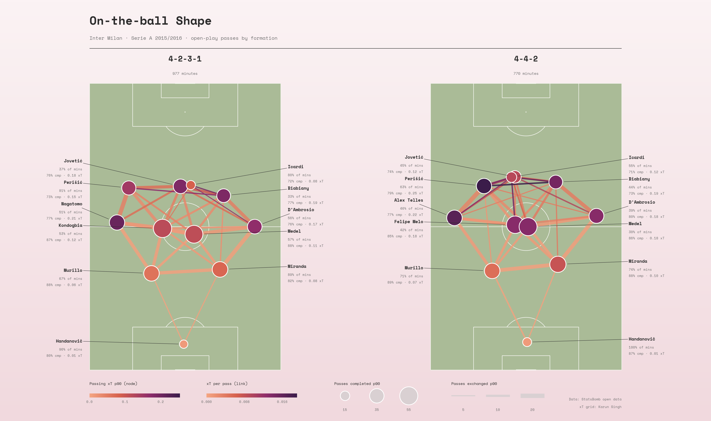

# On-the-ball Shape: Inter Milan 2015/16



Roberto Mancini's Inter used **twelve different formations** in Serie A 2015/16, and their eleven most-used players never started a match together. A classic pass network, with one node per player, would blur these systems together. This project builds **one pass network per formation, with positions as nodes**, so the shapes can be compared side by side.

## Findings

- **4-2-3-1 was built through the middle.** Kondogbia and Medel were the hub, with over 50 completed passes per 90 each and the busiest link on the pitch between them.
- **4-4-2 went down the left.** Alex Telles ↔ Perišić was the strongest link (20 passes per 90), and Perišić created more threat as a left midfielder in 4-4-2 than as a left winger in 4-2-3-1 (0.25 vs 0.15 xT per 90).
- **Icardi barely passed** (14–18 completed passes per 90), so his node is the smallest outfield node in both shapes.

## Method

| Element | Encodes |
|---|---|
| Node position | Average on-ball location: where the position passed from and received |
| Node size | Completed passes per 90 minutes in that formation |
| Node colour | Expected threat (xT) added by the position's passes, per 90 |
| Link width | Completed passes between two positions, both directions, per 90 |
| Link colour | Average xT per pass along that link |
| Label | Player with the most minutes in the position, and their share of them |

- Formations are timed from StatsBomb's *Starting XI* and *Tactical Shift* events, so changes during matches are included.
- Lineups are rebuilt through every substitution and red card to find who played where.
- Open-play passes only. xT uses [Karun Singh's open grid](https://karun.in/blog/expected-threat.html); incomplete and backward passes score 0.
- All values are per 90 minutes of the formation, and scales are shared, so both pitches are directly comparable.

## Project structure

```
├── notebooks/
│   ├── inter_2015_16_pass_network.ipynb   # main analysis (start here)
│   └── exploration.ipynb                  # working notes
├── statsbomb_tools/                       # reusable package for StatsBomb open data
│   ├── data.py        # competitions, matches, events (with local cache)
│   ├── lineups.py     # formations, minutes played, who played where
│   ├── passes.py      # open-play passes, receiver positions, xT
│   ├── network.py     # node and edge tables
│   └── plotting.py    # pass network figures
├── output/                                # saved figures
├── pyproject.toml
└── requirements.txt
```

## Running it

Requires Python 3.10+ (developed on 3.14).

```bash
git clone <this repository>
cd Pass_Network
python -m venv .venv
source .venv/bin/activate
pip install -r requirements.txt
pip install -e .
jupyter lab
```

Open `notebooks/inter_2015_16_pass_network.ipynb` and run all cells. Match data is downloaded on the first run and cached in `data/`. To analyse another team or season, change the parameters cell.

## Reusing the package

```python
from statsbomb_tools.data import load_matches, get_team_id, team_matches, load_events

matches = load_matches(competition_id=12, season_id=27)
team_id = get_team_id(matches, "Inter Milan")
events = load_events(team_matches(matches, team_id)["match_id"], cache_dir="data/events")
```

## Data and credits

- Event data: [StatsBomb open data](https://github.com/statsbomb/open-data)
- Expected threat grid: [Karun Singh](https://karun.in/blog/expected-threat.html)
- Pitch drawing: [mplsoccer](https://mplsoccer.readthedocs.io/)
